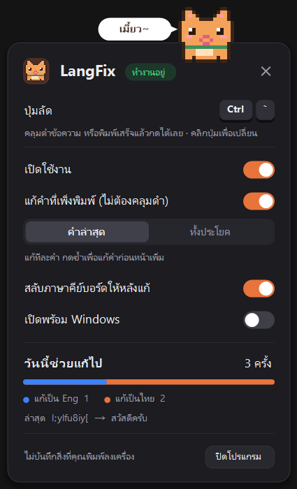

# PimPid 🐱

**ลืมเปลี่ยนภาษาแล้วพิมพ์ไปหลายคำ? กดปุ่มเดียวแก้ให้หมด**

`l;ylfu8iy[` → `สวัสดีครับ` · `้ำสสน` → `hello`

PimPid (พิมพ์ผิด) เป็นแอปเล็กๆ บน Windows ที่แปลงข้อความที่พิมพ์ผิดภาษา ระหว่างแป้นไทย (เกษมณี) กับอังกฤษ (QWERTY) แล้วสลับภาษาคีย์บอร์ดให้พิมพ์ต่อได้เลย

<p align="center"></p>

## ใช้ยังไง

- **คลุมดำข้อความ** ที่พิมพ์ผิดภาษา แล้วกดปุ่มลัด (ค่าเริ่มต้น `Ctrl + Shift + Space`)
- หรือ **ไม่ต้องคลุม** — พิมพ์เสร็จแล้วกดปุ่มลัดได้เลย PimPid จะแก้คำล่าสุดให้ (กดซ้ำเพื่อแก้คำก่อนหน้าเพิ่ม หรือเลือกโหมด "ทั้งประโยค")
- คลิกไอคอนแมวที่ถาดระบบเพื่อตั้งค่า: เปลี่ยนปุ่มลัด, เปิด/ปิด, สลับภาษาอัตโนมัติ, เปิดพร้อม Windows

## ติดตั้ง

1. ดาวน์โหลด `PimPid.exe` จากหน้า [Releases](../../releases/latest)
2. ดับเบิลคลิกเปิดได้เลย ไม่ต้องติดตั้ง

> Windows อาจเตือน "Windows protected your PC" เพราะไฟล์ยังไม่ได้เซ็นดิจิทัล
> กด **More info → Run anyway** (โค้ดทั้งหมดอยู่ใน repo นี้ และไฟล์ใน Releases บิลด์โดย GitHub Actions จากโค้ดนี้โดยตรง)

## ความเป็นส่วนตัว

PimPid ต้องฟังการกดแป้นพิมพ์ (keyboard hook) เพื่อรู้ว่าคุณเพิ่งพิมพ์อะไร จึงแก้คำล่าสุดได้ — แต่:

- จำแค่ตัวอักษรล่าสุดไม่เกิน 300 ตัว **ในหน่วยความจำเท่านั้น** และล้างทุกครั้งที่คลิกเมาส์ กด Enter หรือสลับหน้าต่าง
- **ไม่บันทึกสิ่งที่พิมพ์ลงไฟล์** สิ่งที่บันทึกมีแค่ค่าที่ตั้งและจำนวนครั้งที่แก้ (`%APPDATA%\PimPid\settings.ini`)
- **ไม่ต่ออินเทอร์เน็ต** ไม่มีโค้ดส่งข้อมูลออกไปไหนเลย

## บิลด์เอง

ไม่ต้องลงอะไรเพิ่ม ใช้ตัวคอมไพล์ C# ที่มากับ Windows อยู่แล้ว (.NET Framework 4.x)

```bat
build.bat
```

ได้ `PimPid.exe` ในโฟลเดอร์เดียวกัน

| ไฟล์ | หน้าที่ |
|---|---|
| `src/PimPid.cs` | จุดเริ่มโปรแกรม, ไอคอนถาดระบบ, การแก้ข้อความ |
| `src/Converter.cs` | ตารางจับคู่แป้นไทย ⇄ อังกฤษ |
| `src/Hook.cs` | จับปุ่มลัด + จำตัวอักษรที่เพิ่งพิมพ์ |
| `src/PopupForm.cs` | ป๊อปอัปตั้งค่า |
| `src/ToastForm.cs` | การ์ดแจ้งเตือนตอนเปิดแอป |
| `src/Mascot.cs` | แมวพิกเซล 16×16 (วาดจากโค้ด) |

---

## English

**PimPid** ("typo" in Thai) fixes text typed in the wrong keyboard layout between Thai (Kedmanee) and English (US QWERTY) on Windows. Select the text — or just keep typing — and press the hotkey (`Ctrl + Shift + Space` by default). It converts by key position, then switches your keyboard layout so you can keep going.

Download `PimPid.exe` from [Releases](../../releases/latest) — no install needed. Keystrokes are only held in memory (last ≤300 chars, cleared on click/Enter/window switch); nothing typed is ever written to disk, and the app makes no network connections.

Build from source with `build.bat` (uses the C# compiler bundled with Windows).

License: [MIT](LICENSE)
